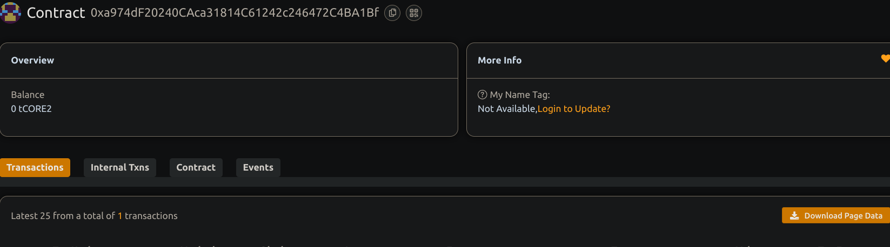

# Governance System with Proposal and Voting Mechanisms     

## 🧠 Project Description              

A decentralized governance system allowing stakeholders to propose and vote on changes or actions. It ensures transparency, community participation, and democratic decision-making.

## 🌍 Project Vision    

To create a foundational governance framework for DAOs or decentralized communities where decisions are made via voting, and proposal outcomes are recorded immutably.

## 🔑 Key Features                     

- Owner creates proposals with a specified deadline
- Community can votes YES/NO within the voting window
- Votes are tracked per user (one vote per address)
- After voting ends, proposals can be executed
- Results are transparently emitted via events

## 🚀 Future Scope

- Token-weighted voting (based on governance tokens)
- Off-chain vote signaling with on-chain commitment
- Proposal queuing and scheduling logic
- Delegation of voting power
- DAO treasury integration for automatic fund execution post - approval 

## 📜 Deployment

```bash
npm install
npx hardhat compile
npx hardhat run scripts/deploy.js --network <your_network>
```

## Contract details
0xa974dF20240CAca31814C61242c246472C4BA1Bf
